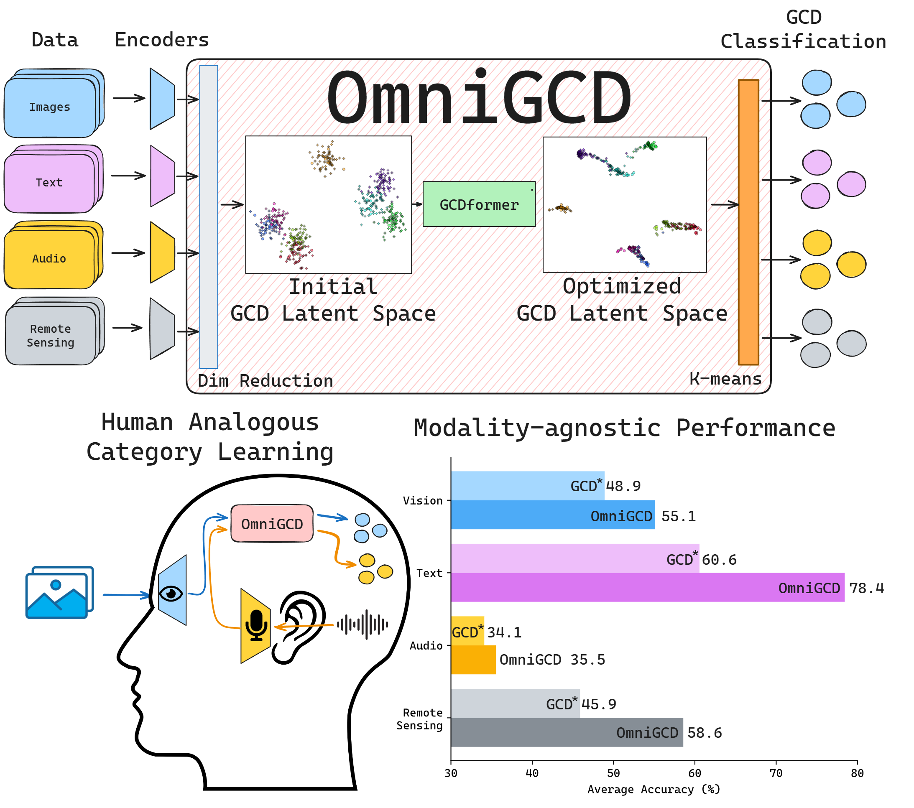
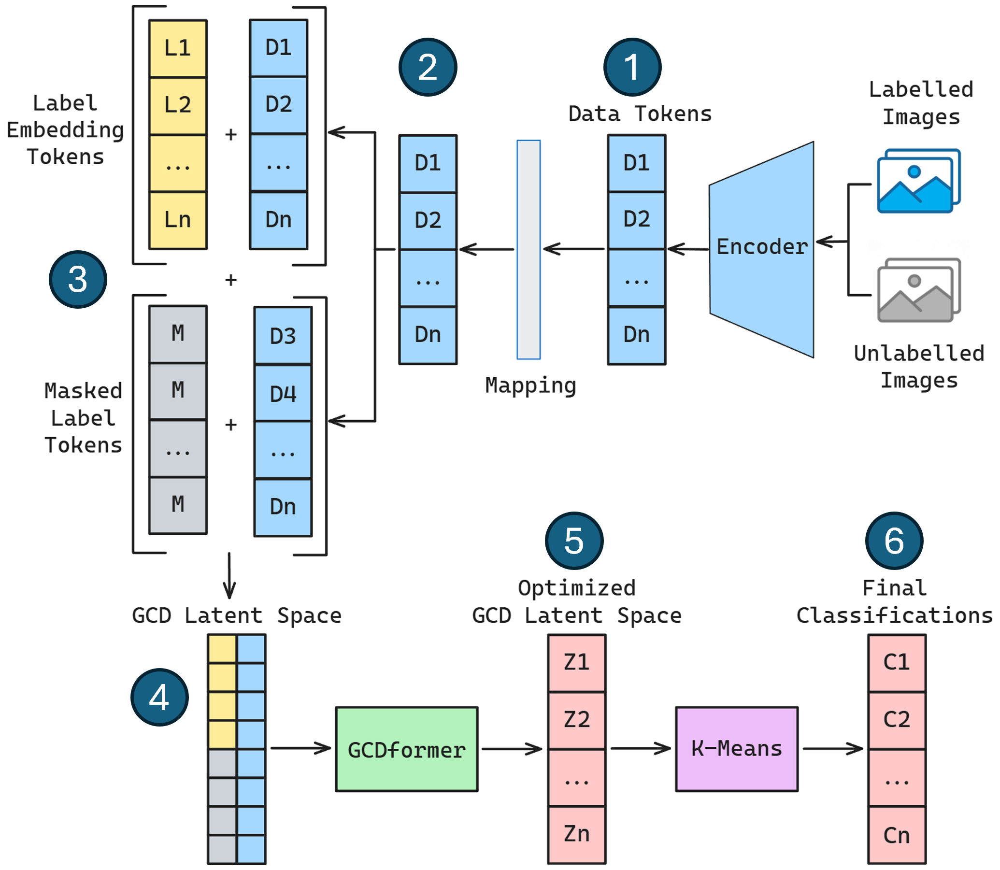
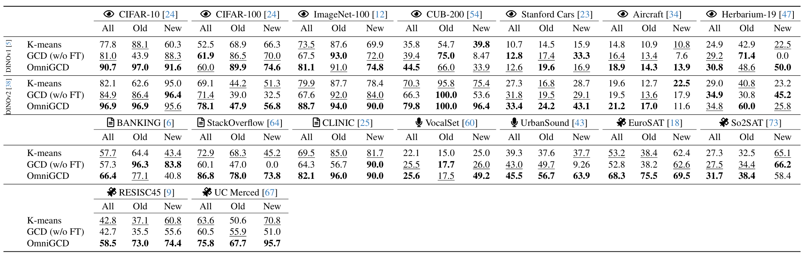

# OmniGCD: Abstracting Generalized Category Discovery for Modality Agnosticism

<p align="center">
  <a href="https://arxiv.org/abs/2604.14762">
    
  </a>
  <a href="poster.pdf">
    
  </a>
  <a href="#citation">
    
  </a>
</p>

<p align="center">
  <b>Jordan Shipard</b><sup>1,2</sup>&nbsp;&nbsp;
  Arnold Wiliem<sup>1,2</sup>&nbsp;&nbsp;
  Kien Nguyen Thanh<sup>2</sup>&nbsp;&nbsp;
  Wei Xiang<sup>3</sup>&nbsp;&nbsp;
  Clinton Fookes<sup>2</sup>
  <br/>
  <sup>1</sup>SAIVT, Queensland University of Technology &nbsp;
  <sup>2</sup>Shield AI &nbsp;
  <sup>3</sup>La Trobe University
</p>

---

> [!NOTE]
> **Code release status.** This repository now contains a clean draft of the OmniGCD code release: GCDformer, synthetic training, zero-shot evaluation from precomputed features, and feature-extraction entry points. The final pretrained GCDformer checkpoint used in the paper will be released separately. Until then, the included training script can train a small synthetic checkpoint for sanity checks; its performance is not expected to match the paper.

## TL;DR

> **One** GCD model. **Any** modality. **No** per-dataset fine-tuning.

OmniGCD is trained **once** on a synthetic clustering task and then performs Generalized Category Discovery zero-shot across **16 datasets spanning 4 modalities** (vision, text, audio, remote sensing) by pairing with off-the-shelf modality-specific encoders.

<p align="center">
  
</p>

## Abstract

Generalized Category Discovery (GCD) challenges methods to identify known and novel classes using partially labeled data, mirroring human category learning. Unlike prior GCD methods, which operate within a single modality and require dataset-specific fine-tuning, we propose a modality-agnostic GCD approach inspired by the human brain's abstract category formation. Our **OmniGCD** leverages modality-specific encoders (e.g., vision, audio, text, remote sensing) to process inputs, followed by dimension reduction to construct a **GCD latent space**, which is transformed at test-time into a representation better suited for clustering using a novel synthetically trained Transformer-based model. To evaluate OmniGCD, we introduce a **zero-shot GCD setting** where no dataset-specific fine-tuning is allowed, enabling modality-agnostic category discovery. **Trained once on synthetic data**, OmniGCD performs zero-shot GCD across 16 datasets spanning four modalities, improving classification accuracy for known and novel classes over baselines (average percentage point improvement of **+6.2**, **+17.9**, **+1.5** and **+12.7** for vision, text, audio and remote sensing). This highlights the importance of strong encoders while decoupling representation learning from category discovery. Improving modality-agnostic methods will propagate across modalities, enabling encoder development independent of GCD. Our work serves as a benchmark for future modality-agnostic GCD works, paving the way for scalable, human-inspired category discovery.

## Method

<p align="center">
  
</p>

OmniGCD treats GCD as a sequence-to-sequence clustering problem in a shared latent space:

1. **Encode.** Compute feature vectors of labelled and unlabelled samples using a frozen modality-specific encoder (DINOv1 / DINOv2 for vision, E5 for text, MERT for audio, DOFA for remote sensing, etc.) — these become **data tokens**.
2. **Map.** Project data tokens, via dimension reduction, into a common low-dimensional GCD latent space.
3. **Tokenize labels.** Concatenate each data token with an embedded label token: a sinusoidal label embedding for known classes, and a learned *masked* token for unknown samples.
4. **Form the GCD latent space.** Concatenate labelled and unlabelled tokens into one set — the *initial GCD latent space*.
5. **GCDformer.** A transformer optimizes the latent space so that same-class points cluster together — the *optimized GCD latent space*.
6. **Cluster.** k-means on the optimized space produces the final classifications.

GCDformer is trained **once** on a synthetic 2D clustering task and then applied — without any fine-tuning — to real datasets across all four modalities.

### Standard GCD vs. Zero-shot GCD

|                | Train-time access to $D_L$ | Train-time access to $D_U$ | Per-dataset fine-tuning |
|----------------|:-:|:-:|:-:|
| Standard GCD   | yes | yes | yes |
| Zero-shot GCD (ours) | no | no | **no** |

In zero-shot GCD, $D_L$ is only consulted at test time to provide the label tokens for known classes.

## Results

OmniGCD performs zero-shot GCD across **16 datasets** spanning **4 modalities**, compared against k-means and a no-fine-tuning GCD baseline.

<p align="center">
  
</p>

See the [poster](poster.pdf) and the [paper](https://arxiv.org/abs/2604.14762) for full details.

## Repository layout

```text
omnigcd/
  models/gcdformer.py        # GCDformer model
  data/synthetic.py          # synthetic GCD latent-space generator
  training/losses.py         # contrastive training loss
  eval/                      # GCD sequence construction, reduction, k-means, metrics
scripts/
  make_toy_features.py       # creates tiny synthetic feature NPZ
  eval_npz.py                # evaluates from precomputed features
  train_gcdformer.py         # synthetic GCDformer training
  extract_vision_features.py # CIFAR vision feature extraction example
  extract_text_features.py   # TSV text feature extraction example
  extract_audio_features.py  # HuggingFace audio feature extraction draft
  extract_remote_sensing_features.py # torchgeo remote-sensing draft
configs/
  train_gcdformer.yaml
checkpoints/
  README.md                  # pretrained checkpoint placeholder
```

## Installation

Create an environment and install the package:

```bash
git clone https://github.com/shield-ai/OmniGCD.git
cd OmniGCD
python -m venv .venv
source .venv/bin/activate
pip install -U pip
pip install -e .
```

For training and feature extraction, install the full dependencies. Choose the PyTorch command appropriate for your CUDA version from <https://pytorch.org/>; for many CUDA 12.1 systems:

```bash
pip install torch torchvision torchaudio --index-url https://download.pytorch.org/whl/cu121
pip install -e '.[all]'
```

Alternatively:

```bash
pip install -r requirements.txt
```

## Smoke test without pretrained weights

This quick test does **not** require the final pretrained model. It creates toy features and evaluates k-means on the reduced GCD latent space. This verifies that the lightweight repo/evaluation path works.

```bash
python scripts/make_toy_features.py --output examples/toy_features.npz
python scripts/eval_npz.py --features examples/toy_features.npz --reduction pca --samples-per-class 5
```

Expected output ends with something like:

```text
---- OmniGCD evaluation ----
All: ... | Old: ... | New: ...
```

## Training GCDformer

Train GCDformer on synthetic GCD latent spaces:

```bash
python scripts/train_gcdformer.py \
  --config configs/train_gcdformer.yaml \
  --output checkpoints/gcdformer_synthetic.pt
```

The default config is intentionally short for sanity checking. Increase `training.epochs` and `training.steps_per_epoch` for real training. The released paper checkpoint will be provided separately.

Evaluate toy features with a trained checkpoint:

```bash
python scripts/eval_npz.py \
  --features examples/toy_features.npz \
  --checkpoint checkpoints/gcdformer_synthetic.pt \
  --reduction pca \
  --samples-per-class 5
```

## Evaluation from precomputed features

All feature extractors and evaluation scripts use a common NPZ schema:

```text
train_features:  [N_train, D]
train_labels:    [N_train]
test_features:   [N_test, D]
test_labels:     [N_test]
known_classes:   [N_known_classes]
unknown_classes: [N_unknown_classes]
```

Run zero-shot GCD evaluation:

```bash
python scripts/eval_npz.py \
  --features features/my_dataset_features.npz \
  --checkpoint checkpoints/gcdformer_paper.pt \
  --reduction tsne \
  --latent-dim 2 \
  --samples-per-class 20
```

If `--checkpoint` is omitted, the script reports the reduced-feature k-means baseline.

## Feature extraction examples

### Vision: CIFAR-10 with DINOv2

```bash
python scripts/extract_vision_features.py \
  --dataset cifar10 \
  --encoder dinov2_vitb14 \
  --data-root data \
  --output features/dinov2_cifar10.npz
```

Then evaluate:

```bash
python scripts/eval_npz.py \
  --features features/dinov2_cifar10.npz \
  --reduction tsne \
  --samples-per-class 20
```

### Text: TSV files

Prepare `train.tsv` and `test.tsv` with columns `text` and `label`, then run:

```bash
python scripts/extract_text_features.py \
  --train-tsv path/to/train.tsv \
  --test-tsv path/to/test.tsv \
  --encoder intfloat/e5-large-v2 \
  --output features/e5_text_dataset.npz
```

### Audio: HuggingFace audio datasets

```bash
python scripts/extract_audio_features.py \
  --hf-dataset danavery/urbansound8K \
  --label-column classID \
  --known-classes 0 1 2 3 4 \
  --unknown-classes 5 6 7 8 9 \
  --output features/mert_urbansound.npz
```

### Remote sensing

```bash
python scripts/extract_remote_sensing_features.py \
  --dataset resisc45 \
  --data-root data \
  --encoder resnet50 \
  --output features/resisc45_resnet50.npz
```

The paper used DOFA for multispectral remote-sensing experiments. This draft remote-sensing script is a clean RGB/torchgeo starting point; DOFA support can be added while preserving the same NPZ schema.

## Notes for reproducing paper numbers

- Use the released paper checkpoint once available.
- Use t-SNE reduction (`--reduction tsne --latent-dim 2`) for the main OmniGCD setting.
- Use the exact dataset splits and samples-per-class values reported in the supplementary material.
- The provided toy training config is a sanity check, not the final training recipe.

## Poster

The CVPR poster is included in this repo: [`poster.pdf`](poster.pdf).

## Citation

If you find OmniGCD useful in your research, please cite:

```bibtex
@inproceedings{shipard2026omnigcd,
  title     = {OmniGCD: Abstracting Generalized Category Discovery for Modality Agnosticism},
  author    = {Shipard, Jordan and Wiliem, Arnold and Nguyen Thanh, Kien and Xiang, Wei and Fookes, Clinton},
  booktitle = {IEEE/CVF Conference on Computer Vision and Pattern Recognition (CVPR)},
  year      = {2026}
}
```

## Acknowledgements

This work was supported by the **SmartSat CRC** (funded by the Australian Government's CRC Program) and by **Shield AI**, a global leader in AI pilots for defence and civilian applications. We also build on prior work in Generalized Category Discovery, in particular Vaze et al. (CVPR 2022).
